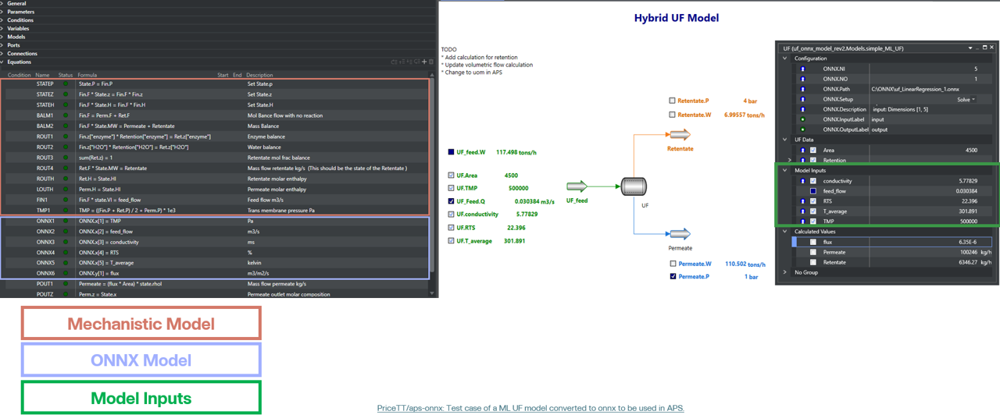

# Converting Sklearn UF model to onnx

Test case of a **Linear Regression and DecisionTreeRegressor model** fitted to siulated UF data and converted to onnx to be used in Aveva Process Simulator (APS).  

**⚠️ WARNING: Use at Your Own Risk**  
>
> This code is provided as-is and without any guarantees and is for educational purposes.  

<p align="center">
  
</p>

## Key files:
* **models/uf_LinearRegressor_1.onnx**: Predicts flux based on inputs.
* **models/uf_LinearRegressor_2.onnx**: Predicts flux based on inputs with a different export.
* **models/uf_onnx_model_rev3.simx**: APS Hybrid UF model simulation.
* **uf_fitting_onnx.ipynb**: Fit and generate the onnx model
* **/data/cuf_data.csv**: Simulated data for fitting.


## Setting up your development environment 
* Install MiniForge https://github.com/conda-forge/miniforge?tab=readme-ov-file
* install vscode https://code.visualstudio.com/ and extensions  ms-python.vscode-pylance, ms-python.python, ms-toolsai.jupyter
* install gitbash https://git-scm.com/download/win


## Set up ENV
1. Using the terminal clone the repo `git clone git@github.com:PriceTT/aps-onnx.git`
2. Navigate to project folder and run the command below to the create conda environment which reads the environment.yml file.
3. Conda manages the Python virtual environment, while Poetry handles package management. Here are the essential commands:   
    ``` conda env create ```  
    * Activate the virtual environment  with
    ```conda activate onnx-env```
    * Install the packages using poetry (retry if it fails)
    ``` poetry install -vvv  ```
    * To update the packages 
   ``` poetry update ```
    * To remove the env
   ``` conda env remove --name onnx-env ```
   * The interpreter path can be found by tying  ```which python```
   * Append the project's virtual env to the jupyter kernels
   ``` python -m ipykernel install --user --name aps-env --display-name "onnx-env" ```